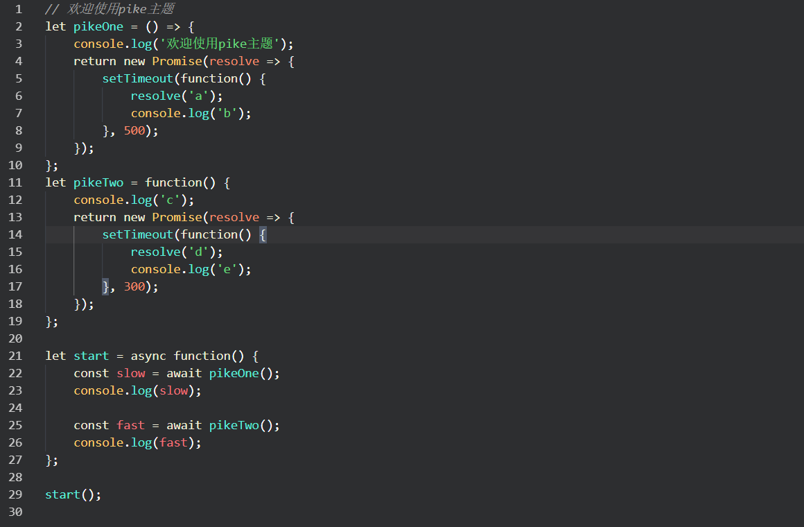
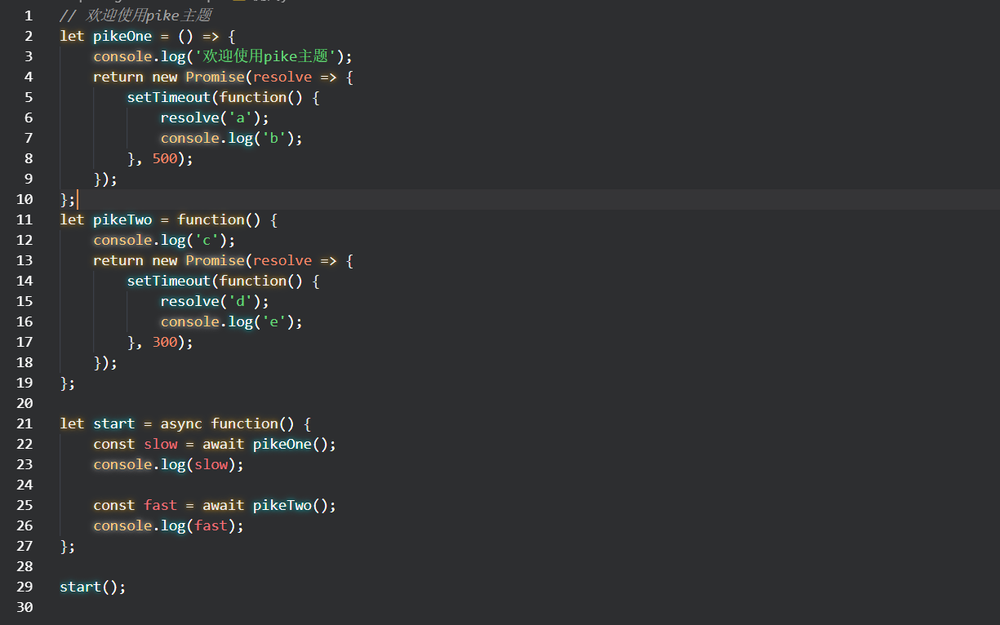
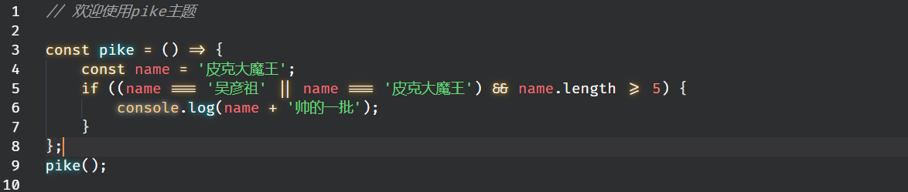

## pike主题效果展示

### 普通主题

### 发光的主题

如果你想弄成这种花哨(发光)的效果：首先你得安装一个[Custom CSS and JS Loader](https://marketplace.visualstudio.com/items?itemName=be5invis.vscode-custom-css)插件(这个插件允许你修改vscode内部样式)，使用项目中的pike-theme.css替换css文件即可

### 带连字符的主题

我个人是比较喜欢连字符 [Fira Code](https://github.com/tonsky/FiraCode)，

